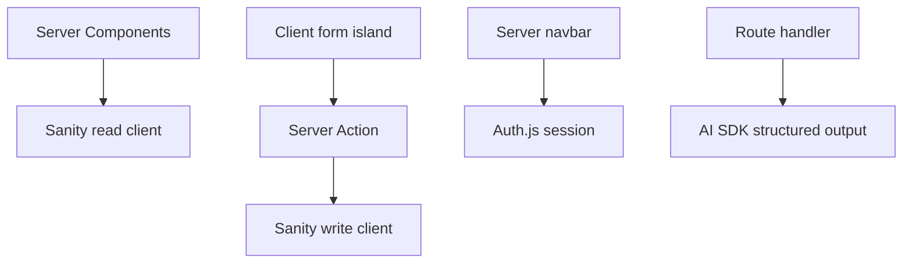

# Architecture Notes

## Runtime Boundaries

## Request Decisions

| Flow | Boundary |
|---|---|
| Feed/search | Server Component reads `searchParams` |
| Create pitch | Client form -> Server Action |
| AI analysis | Route handler |
| Auth callback | Auth.js route handler |
| Public CMS content | Cached server read |
| Read-after-write | Fresh server read / write client |

## Why AI Is a Route Handler

The AI call is not a normal form mutation. It is a server-only HTTP boundary
that may be called from a client editor preview, rate-limited, monitored, and
key-protected. A route handler is a clear place for that contract.

